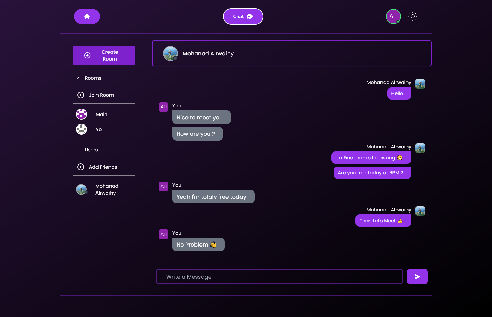
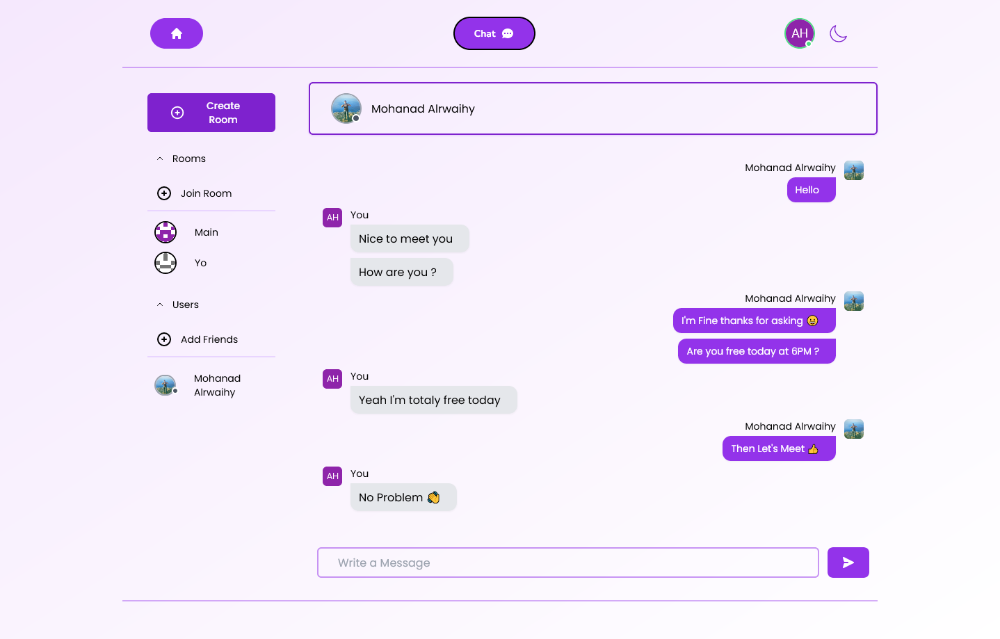

# Chatty 💬

Chatty is a chat application using Socket.IO server to establish a Web Socket connection between the server and clients, You can add friends, join rooms Create New rooms and start real-time chatting.

## Table of contents
- Overview
  - [Features](#Features)
  - [Screenshot](#Screenshot)
  - [Links](#Links)
  - [Setup](#Setup)
- My process
  - Built with
	  - [Client](#Client)
	  - [Server](#Server)
- [Author](#Author)

## Overview

### Features
- View the optimal layout for the site depending on their device's screen size 💻/ 📱
- Save user details in database (Firebase) ✨
- Ability to Sign Up and Log In using your details or with Google ✨
- Create Rooms, Join Rooms, Add Friends and start chatting 🫡
- Landing page about the application ✨
- Dark and Light Theme 🎨
- Animation appears depending on the viewport 🎞️

### Screenshot



### Links

- Live Site URL: [Here](https://chat-application-firebase.vercel.app/)
- GitHub URL: [Here](https://github.com/MohanadOO/Chatty) 

### Setup

```shell
# Client
$ npm install
$ npm run dev

# Server 
$ npm install 
$ npm run start
```

## My process

### Built With

#### Client
- [React](https://reactjs.org/) - JS library
- [Tailwind CSS](https://tailwindcss.com/) - CSS framework
- [Firebase](https://firebase.google.com/?gclid=Cj0KCQiA2-2eBhClARIsAGLQ2Rn0yJmEFiDC4TmS38RrSNEvLnhCqXlhBaDbCAT8mghMJ0k1uzUaow0aAoFrEALw_wcB&gclsrc=aw.ds) - 
- [Framer Motion](https://www.framer.com/motion/) - Animation Library for React
- [React Icons](https://react-icons.github.io/react-icons/) - React icons provides a huge collections of icons from different sources.
- [React Router](https://reactrouter.com/en/main) - Enables client side routing
- [React Hook Form](https://react-hook-form.com/) - Easy to use hooks to create forms 
- [React Hot Toast](https://react-hot-toast.com/) - React Notifications
- [SocketIO Client](https://socket.io/) - Bidirectional and low-latency communication for every platform

#### Server
- [Express](https://expressjs.com/) - Web Framework for NodeJS
- [Socket.IO](https://socket.io/) - enable real-time bidirectional communication between server and browser
- [Nodemon](https://www.npmjs.com/package/nodemon) - Helps with NodeJS by automatically restarting the server when any change happen.

## Author

- Website - [Mohanad Portfolio](https://mohanad.in)
- Twitter - [@MohanadOO_](https://twitter.com/MohanadOO_)
- LinkedIn - [Mohanad Alrwaihy](https://www.linkedin.com/in/mohanad-alrwahiy-176aa719b/)
